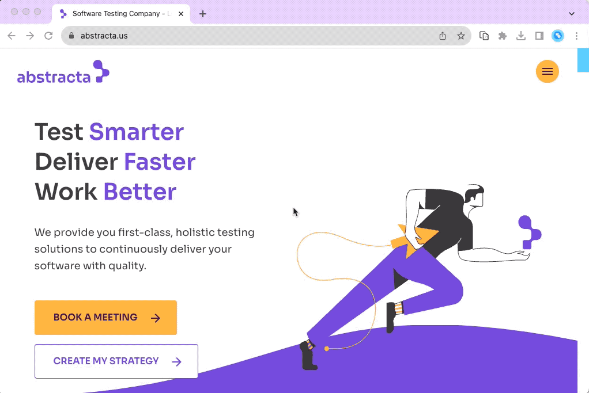

Browser Copilot is a browser extension that allows you to use existing or custom-built AI assistants to help you in everyday web application tasks.



## Motivation

The goal is to provide a versatile UI and simple framework to implement and use an ever-increasing set of copilots (AI assistants). These copilots can help in a wide range of tasks by taking advantage of browser extension capabilities. 

Here are a few examples of what these copilots can do:

- 🤖 Automatically activate copilots that are relevant to specific web applications. For instance, a Mail Copilot can activate when a Mail web app is loaded in a browser tab.
- 🔍 Extract information from the current web application. For example, the copilot could extract current mail content, from a Mail web app, and provide a summarization of the mail, or users may ask questions about the mail contents.
- ⚙️ Interact with web applications. A copilot could generate mail bodies based on user requests. It could also fill web app form fields with appropriate test data.
- 🔌 Use any service API to extract additional information or automate web app processes. For example, the copilot could retrieve valid examples from the web app backend to populate frontend forms.
- 💡 Many other ideas and capabilities can be explored by combining the browser extension with AI and LLM capabilities.

## Usage

1. Install the extension in your browser by downloading the latest version from the [releases](https://github.com/abstracta/browser-copilot/releases). To install an extension from a zip file you need to go to your browser "Manage Extension" screen, enable developer mode, and drag and drop the extension zip file.
2. Open the extension by clicking on its icon and add a new copilot by providing its base URL. The base URL should correspond to the location of `manifest.json` and `logo.png`, for example: `http://localhost:8000` if your agent is running locally.
3. Start a new chat by clicking on a configured copilot, or, if the copilot has automatic activation, just use your browser and the copilot chat will automatically appear when the copilot activates.
4. Save your preferred prompts directly from the chat. To quickly access them later, simply type '/' in the chat input.

At any point, you can close the copilot to later resume the conversation by the extension icon or right-clicking on the page and selecting `Toggle Browser Copilot`.

If you don't know any copilot URLs, this project includes a simple copilot implementation in [agent folder](./agent). You can start it by copying [agent/sample.env](./agent/sample.env) to `agent/.env`, changing the environment variables on it, and running `docker-compose up` (docker is required for this). Once started, you can configure your extension to use it by adding a copilot with the URL `http://localhost:8000`.

When you activate the copilot (click on the copilots list), it will request some credentials. Use `test` user and `test` password to login.

In the future, we plan to add a catalog of copilots contributed by the community. Therefore, **if you create new copilots, please let us know** so we can include them in the initial catalog.

## Development

### Agent Development

To develop a new agent, you can refer to the [agent-mock](./agent-mock), [agent-simple](./agent-simple) or [agent-extended](./agent-extended/) folders. The later is the most complete one with proper documentation on endpoints and `manifest.json`.

For the development environment, this project uses [devbox](https://www.jetpack.io/devbox) and [direnv](https://github.com/direnv/direnv).

To install all required dependencies (after installing devbox and direnv), run the following command:

```bash
devbox run install
```

Next, set appropriate environment variables in `agent-extended/.env`.

> To speed up development, you can comment out the Keycloak section, so you don't need to authenticate every time you want to try your copilot in the extension.
> If you don't comment out the Keycloak section, then you need to run `devbox run keycloak` to spin up Keycloak for authentication and use `test` `test` credentials for login (when requested by the browser extension).

To run the agent in dev mode, enabling automatic hot-reloading whenever any changes are detected in the agent source files, execute the following command:

```bash
devbox run agent
```

> If you want to debug the agent, you can start the agent with your preferred IDE, pointing to the relevant virtual environment created by devbox, and using IDE's debugger capabilities to run the [main script](./agent/gpt_agent/__main__.py).

For more details about the agent, please refer to [its readme](./agent/README.md).

### Browser Extension Development

If you plan to contribute changes to the browser extension, refer to the [browser-extension folder](./browser-extension).

To launch a Chrome browser with hot-reload capabilities, use the following command:

```bash
devbox run browser
```

To modify the default browser settings, consult [browser-extension/vite.config.ts](./browser-extension/vite.config.ts).

To build the final distribution of the extension, execute the following command:

```bash
devbox run build
```

## Contributing

We welcome all kinds of contributions!

* ⭐ **Give this project a star** to make it more visible to the entire community. It lets us know that you are interested in this project, motivating us to invest more effort into it.
* 📢 Spread the word about this project. If you make any publications (tweets, StackOverflow mentions, LinkedIn posts, Medium articles, etc.) about it, please let us know. We plan to add references to such publications in the future.
* 🙋 Ask questions and request improvements by creating issues or opening discussions in the repository.
* 🧑‍💻 If you enjoy coding, you can build new agents, helping us implement browser extension features or general improvements.
