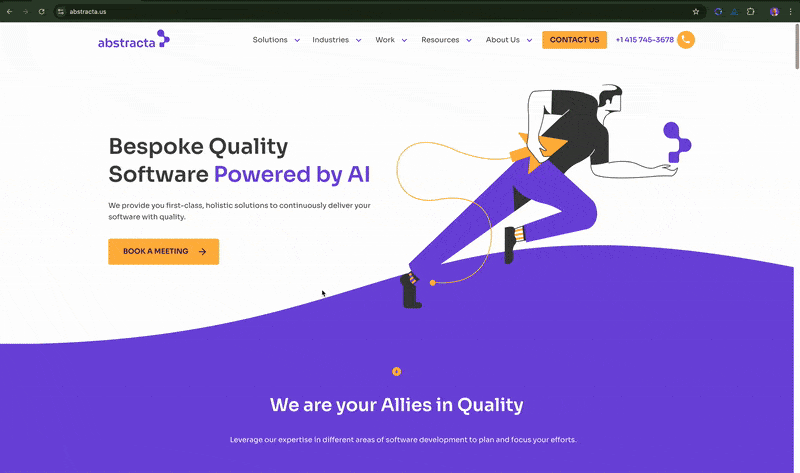

# UpCamp Agent

This is an example agent for **supporting non-experienced workers in their daily activities** based on the [agent-extended](../agent-extended/README.md), which integrates with OpenAI (or Azure OpenAI) and provides a similar basic experience to ChatGPT, including authentication, proper session handling, response streaming and transcripts support.

It is developed using the following:

* [FastAPI](https://fastapi.tiangolo.com/)
* [LangChain](https://www.langchain.com/)
* [Poetry](https://python-poetry.org/)

The agent is configured with a system prompt aimed to help workers with their daily tasks. This prompt can be modified to suit your needs by editing the system prompt variable in the environment's variables (for references check the `SYSTEM_PROMPT` variable in the [sample.env](./sample.env) file).

The agent is also provisioned with six prompts to facilitate the user interaction and foster its usage. You could add more by editing the prompts collection in the [manifest.json](./gpt_agent/assets/manifest.json), but bear in mind that if you want to use more advanced or larger prompts it could be a good idea to create a separate agent for a specific purpose and use the `SYSTEM_PROMPT` variable to instruct the agent.

## Use Cases
### 1. Chat with GPT
As mentioned before, you could use this agent to chat and iterate over problems like you would do with ChatGPT.
### 2. Use Predefined Prompts
You can access the prompts list by typing `/`, and selecting the prompt you want to use. All the prompts in this example have an input variable which makes the cursor automatically placed where the user should fill in the proper input.

## Other capabilities
### Authentication

The browser extension provides support for [OpenID Connect](https://en.wikipedia.org/wiki/OpenID#OpenID_Connect_(OIDC)) authentication.

Including in `manifest.json` an `auth` section with the following properties will enable this functionality:

* `url`: the OpenID base url. Check [sample.env](./sample.env) for some examples.
* `clientId`: the client ID registered in your OAuth Provider for the copilot.
* `scopes`: the scopes required for your copilot. Check [sample.env](./sample.env) for some examples.

Provided [sample.env](./sample.env) includes configurations for using Keycloak or Microsoft Entra ID.

#### Microsoft Entra ID

1. Register the Chrome extension in Azure as described [here](https://learn.microsoft.com/en-us/entra/identity-platform/quickstart-register-app).
   E.g.: use `browser-copilot` as the name and `https://nnllgflhcpaigpehhmbdhpjpakmofemh.chromiumapp.org/` as the redirect URI (check the proper ID for the Chrome extension by accessing manage extension in Chrome.)
   Remember to enable user assignment and assign users that should be able to access the copilot.
2. Register the backend agent (API) for the copilot in Azure as described [here](https://learn.microsoft.com/en-us/entra/identity-platform/quickstart-configure-app-expose-web-apis) and [here](https://learn.microsoft.com/en-us/entra/identity-platform/quickstart-configure-app-access-web-apis).
   E.g.: using `gpt-copilot` as the name
   Remember to expose the API and add a scope (E.g.: `Chat`).
   Also, remember to add the API to the extension (`browser-copilot`) app registration.
3. Use the extension (`browser-copilot`) client ID and proper API scope (Eg: `api://2e990215-c550-468b-950e-3008832f3fbb/Ask openid profile`) in your `.env` file.

#### Google OAuth

To add Google auth, you can use Keycloak and configure Google as an ID Provider.

To do so with the provided Keycloak, **which should not be used for production scenarios**, you can go to [identity providers section in Keycloak admin console](http://localhost:8080/admin/master/console/#/browser-copilot/identity-providers), with `admin` `admin` credentials, select the `browser-copilot` realm, and then add the Google as provider configuring proper client ID and client secret obtained from Google. 
In Google, you will need to create OAuth credentials as described [here](https://developers.google.com/identity/protocols/oauth2/web-server#creatingcred) using the redirect URI you get from Keycloak Google provider registration page (eg: `http://localhost:8080/realms/browser-copilot/broker/google/endpoint`). 

For the time being, we haven't found a generic solution that allows direct integration with Google Auth. 
[Here](https://stackoverflow.com/questions/60724690/using-google-oidc-with-code-flow-and-pkce) is an issue we have faced when trying it. 
Another issue we have faced is that using [Google's proposed solution for Chrome extensions](https://developer.chrome.com/docs/extensions/how-to/integrate/oauth) requires knowing the client ID before building and publishing the extension, which is not good to allow any user to be able to use their own Google OAuth config without having to rebuild the extension.
If you have any ideas please let us know by creating an issue or discussion in this repository.
